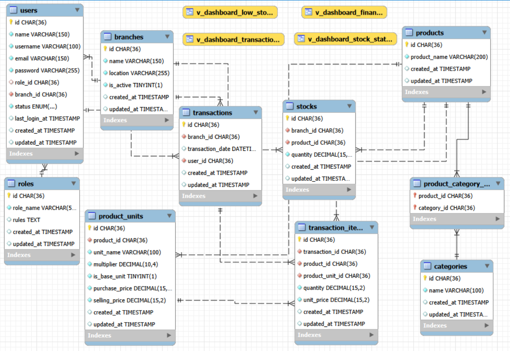

# Backend Documentation

Dokumentasi teknis untuk REST API Kiru App yang dibangun dengan Express JS.

---

## 🗂️ Struktur Folder

```
backend/
├── configs/
│       App.js                  # Inisialisasi Express & middleware global
│       Db.js                   # Konfigurasi koneksi MySQL
│
├── controllers/
│       AuthController.js
│       BranchController.js
│       CategoryController.js
│       DashboardController.js
│       ProductController.js
│       RoleController.js
│       StockController.js
│       TransactionController.js
│       UserController.js
│
├── domains/                    # Penghubung antara service dan repository, berisi pengkondisian tipis
│       AuthDomain.js
│       BranchDomain.js
│       CategoryDomain.js
│       DashboardDomain.js
│       ProductDomain.js
│       RoleDomain.js
│       StockDomain.js
│       TransactionDomain.js
│       UserDomain.js
│
├── middleware/
│       AuthMiddleware.js       # Verifikasi JWT & inject req.user
│       ErrorHandler.js         # Global error handler
│       RateLimiter.js          # Pembatas request per IP
│
├── models/
│   ├── entities/               # Definisi struktur tabel/model
│   │       BranchEntity.js
│   │       CategoryEntity.js
│   │       ProductEntity.js
│   │       ProductUnitEntity.js
│   │       RoleEntity.js
│   │       StockEntity.js
│   │       TransactionEntity.js
│   │       TransactionItemEntity.js
│   │       UserEntity.js
│   │
│   ├── responses/              # Standar struktur response API
│   │       AuthResponse.js
│   │       ProductResponse.js
│   │       TransactionResponse.js
│   │       UserResponse.js
│   │
│   └── schemas/                # Validasi request body (Joi)
│           AuthSchema.js
│           ProductSchema.js
│           StockSchema.js
│           TransactionSchema.js
│           UserSchema.js
│
├── repositories/               # Query layer — akses langsung ke DB
│       AuthRepository.js
│       BranchRepository.js
│       CategoryRepository.js
│       DashboardRepository.js
│       ProductRepository.js
│       RoleRepository.js
│       StockRepository.js
│       TransactionRepository.js
│       UserRepository.js
│
├── routes/
│       MainRoutes.js           # Semua route
│       AuthRoutes.js
│       BranchRoutes.js
│       CategoryRoutes.js
│       DashboardRoutes.js
│       ProductRoutes.js
│       RoleRoutes.js
│       StockRoutes.js
│       TransactionRoutes.js
│       UserRoutes.js
│
├── seeders/
│       Run.js                  # Entry point jalankan semua seeder
│       Data.js                 # Data dummy/awal
|
├── services/                   # Business logic 
│       AuthService.js
│       BranchService.js
│       CategoryService.js
│       DashboardService.js
│       ProductService.js
│       RoleService.js
│       StockService.js
│       TransactionService.js
│       UserService.js
│
└── utils/
        hash.js                 # Helper bcrypt (hash & compare)
        jwt.js                  # Helper generate & verify token
        pagination.js           # Helper kalkulasi offset & limit
```

---

## ⚙️ Setup & Konfigurasi

### Environment Variables

Buat file `.env` di root folder backend:

```env
PORT=5000
DB_HOST=localhost
DB_PORT=3306
DB_NAME=kiru_app
DB_USER=root
DB_PASS=yourpassword
JWT_SECRET=your_jwt_secret_key
JWT_EXPIRES_IN=7d
BCRYPT_SALT=10
```

### Install & Jalankan

```bash
# 1. Import database terlebih dahulu
mysql -u root -p kiru_app < database.sql

# 2. Install & jalankan
npm install
npm run seed:all  # Isi data awal (roles, branches, user default)
npm run dev       # Development dengan nodemon
npm start         # Production
```

---

## 🔐 Autentikasi & RBAC

Autentikasi menggunakan **JWT (JSON Web Token)**. Setiap request ke endpoint yang dilindungi wajib menyertakan token di header:

```
Authorization: Bearer <token>
```

### Middleware Auth

```javascript
// middleware/AuthMiddleware.js
// Verifikasi token JWT dan inject user ke req.user
```

### Hierarki Role

| Role | Akses |
|------|-------|
| `owner` | Semua fitur, semua cabang |
| `admin` | Stok & produk, hanya cabang sendiri |
| `kasir` | Transaksi POS, hanya cabang sendiri |

---

## 📊 Schema Database
 

 
*Gambar di atas menunjukkan hubungan antara tabel*
 
---

## 📦 Dependencies Utama

```json
{
  "express": "^4.x",
  "mysql2": "^3.x",
  "jsonwebtoken": "^9.x",
  "bcrypt": "^5.x",
  "dotenv": "^16.x",
  "cors": "^2.x"
}
```
